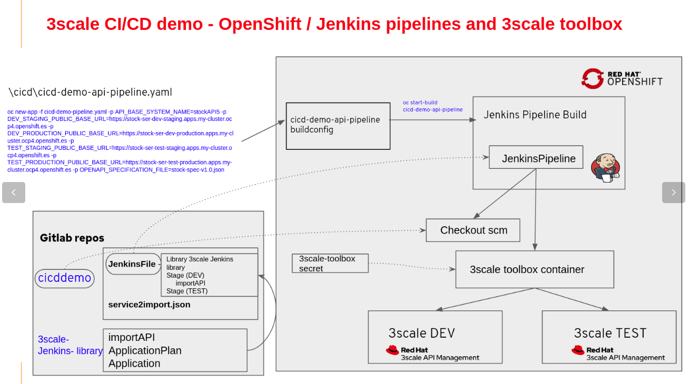

# 3scale CI/CD DEMO using the 3scale toolbox Jenkins shared library
This repository holds an example to showcase the use of the 3scale toolbox Jenkins shared library to automate the delivery of APIs using CI/CD and more specifically Jenkins pipelines.

##  Demo story
We want to automate deployment of an API managed by 3scale across multiple environments, using pre-defined pipelines provided by the platform. The delivery pipelines must support environment-specific properties, testing, versioning, and the ability to rollback incomplete or failed deployments.

## Prerequisites

The demo requires these components:

   - **Red Hat OpenShift Container Platform:** access to an OpenShift cluster through the OpenShift CLI ("oc") is required.
   - **Red Hat 3scale API Management:** in order to simulate two 3scale environments (DEV & TEST). You can create:
       - Two tenants on your on-premises 3scale instance. 
       - or combine an on-premises tenant with a 3scale.net account.
       - or use two 3scale.net accounts. 
   - **3scale toolbox:** this is the 3scale CLI for importing and promoting a 3scale service into an API Manager.
   - **A Jenkins instance:** deployed on your OCP cluster. If you need, you could customize this demo to use an external Jenkins instance.

## Install demo
There are two use cases according the sort of file that we will use as a point of truth:
- [x] **Use case 1:** an OpenAPI 3 or a Swagger file, please check directory "/openapi"  
- [x] **Use case 2:** an API Product yaml file, please check directory "/apiproduct"  

Please check this guide: [Installation guide](Installation.md)

## Components demo flow
Find in this diagram the API lifecycle automation sequence flow 

